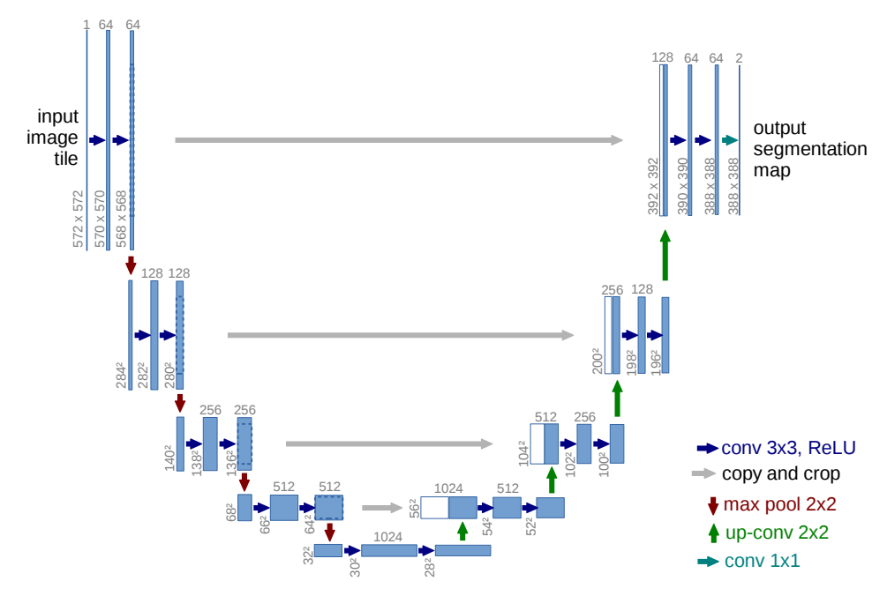

# U-Net Implementation in PyTorch
Implementation of U-Net architecture in PyTorch.

Based on the architecture from the U-Net paper: https://arxiv.org/abs/1505.04597.

Trained on the ISBI-2012 Segmentation Challenge dataset: https://imagej.net/events/isbi-2012-segmentation-challenge.

